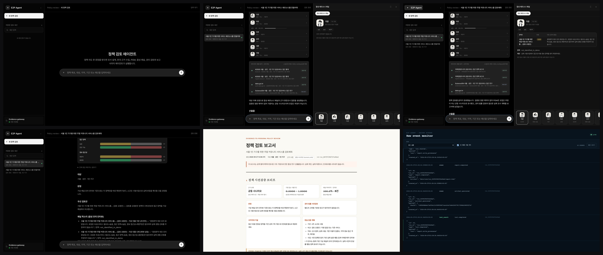
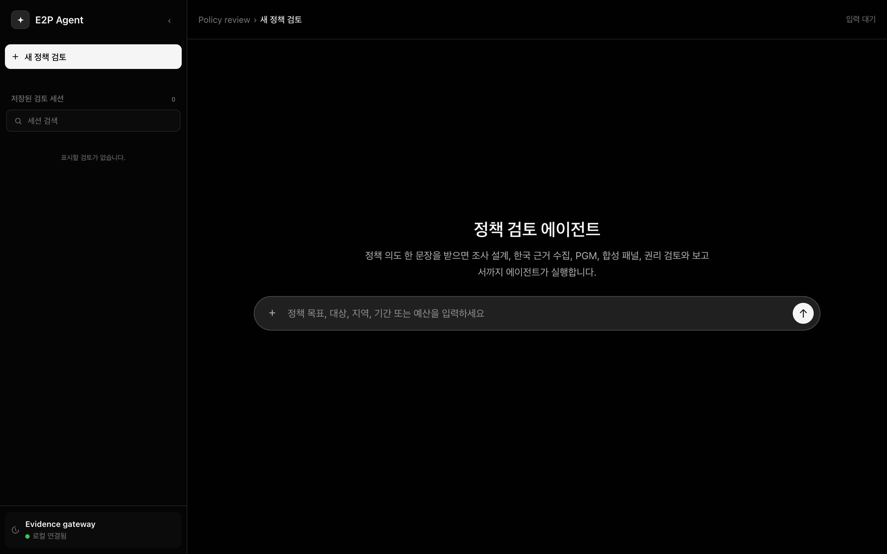
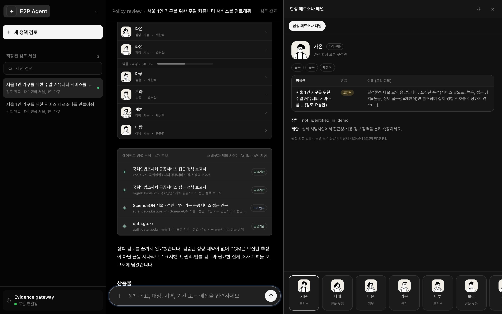
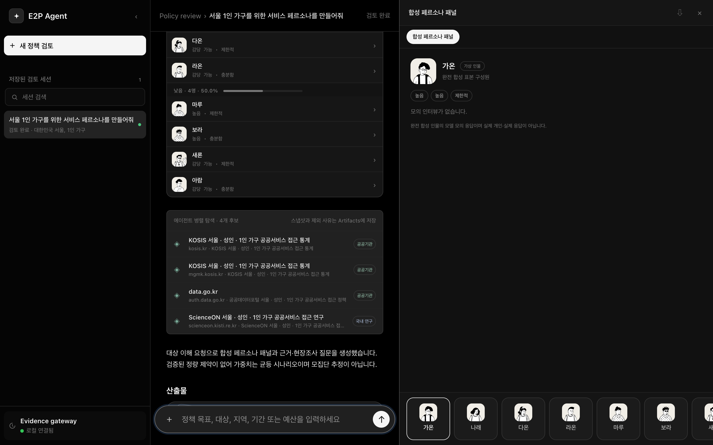
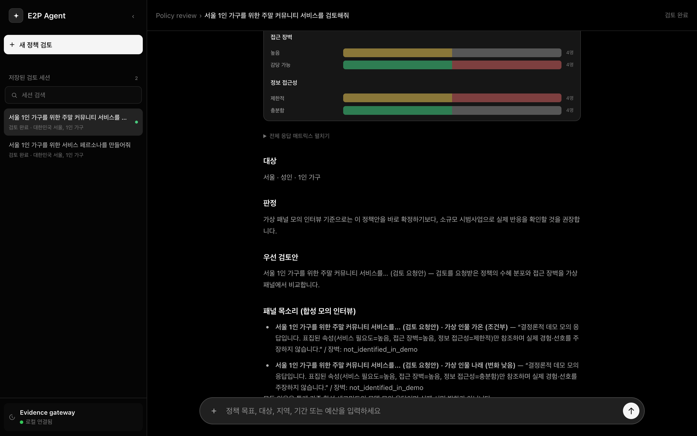
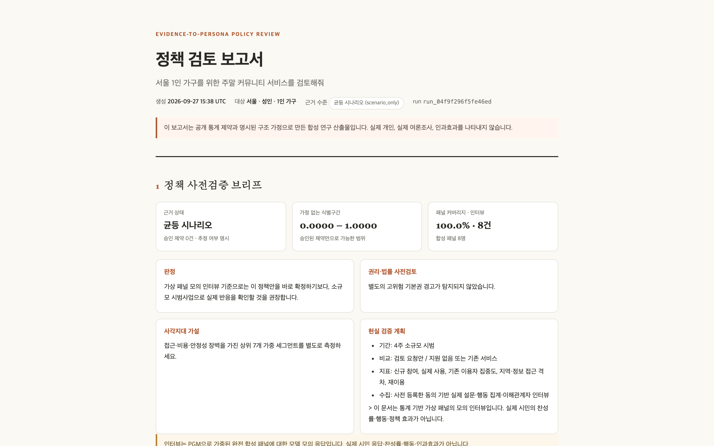
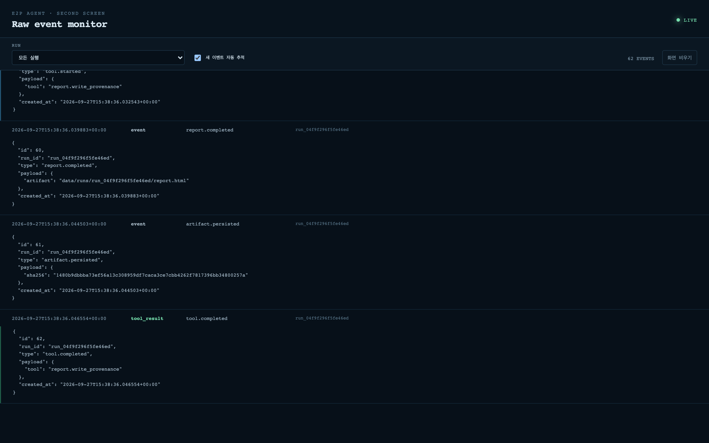
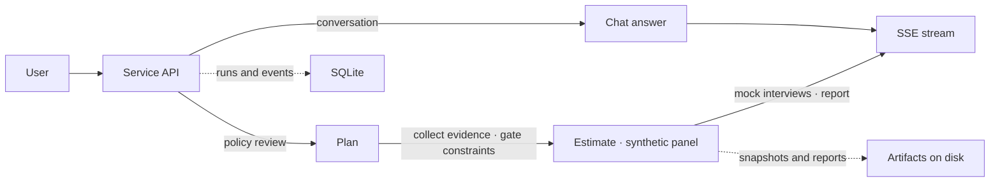

<h1 align="center">E2P</h1>

<p align="center">
  
  
  
  
</p>

<p align="center">
  <sub><a href="docs/README.ko.md">한국어</a></sub>
</p>

<p align="center">
  <strong>Synthetic persona panels that say where their numbers come from.</strong><br/>
  E2P (Evidence-to-Persona) turns one sentence of policy or product intent into a weighted panel of synthetic personas<br/>
  built from Korean public statistics, interviews the panel about the proposal, and reports the blind spots, the uncertainty<br/>
  and the questions a real survey still has to answer.
</p>

<h3 align="center"><a href="#getting-started"><ins>Getting started</ins></a> &nbsp;·&nbsp; <a href="#how-a-review-runs"><ins>How a review runs</ins></a> &nbsp;·&nbsp; <a href="#what-the-numbers-mean"><ins>What the numbers mean</ins></a></h3>



## The problem

Building a defensible persona set means collecting statistics and reports, checking that their populations, reference dates and variable definitions are compatible, and only then deciding on representative types and their weights. A generative model skips all of that: it will happily combine numbers before checking their sources, or invent a plausible-looking setting from nothing.

E2P keeps the language model where it is useful, in planning, extraction and narration, and puts the parts that must not be improvised, source validation, constraint approval, statistics and safety, in code. Every output carries its sources, its weights, its uncertainty and the questions that only a real survey can settle.

## What you get

| You type | E2P returns |
|---|---|
| "Build service personas for single-person households in Seoul" | A weighted synthetic persona panel, the evidence status behind it, its uncertainty, and field-survey questions |
| "Review a weekend community service for single-person households in Seoul" | The same panel plus a mock review of the proposal, blind-spot hypotheses, suggested fixes and a real-world validation plan |

Attach an existing planning document (`.md`) with the `+` button and it becomes the policy under review: target group, variables and interview questions are derived from the document, and the chat line only needs the request itself.

## Features

<table>
<tr>
<td width="50%" valign="middle">

### One sentence in, a full review out

Chat input is classified first. A `policy_review` request starts the autonomous pipeline; `clarify` asks for target, scope or instrument when they are missing; `conversation` answers follow-up questions over the session memory with streamed responses.

</td>
<td width="50%">
  
</td>
</tr>
<tr>
<td width="50%" valign="middle">

### Evidence you can open

Sources are searched in parallel across Korean public institutions and research portals while KOSIS tables are downloaded directly. Raw documents are pinned as snapshots, and each candidate shows its host, its classification and why it was kept or excluded.

</td>
<td width="50%">
  
</td>
</tr>
<tr>
<td width="50%" valign="middle">

### A panel with weights, not a cast of characters

Segments are built per attribute combination with their share of the population. Combinations that fall outside the headcount cap are recorded separately as blind spots instead of being silently dropped. Each persona is labelled as fully synthetic.

</td>
<td width="50%">
  
</td>
</tr>
<tr>
<td width="50%" valign="middle">

### Mock interviews against the proposal

Every persona is interviewed about the policy under review. Responses are grouped as conditional, low change, refusal or positive, and each answer states which sampled attributes it drew on and what barrier it reports.

</td>
<td width="50%">
  
</td>
</tr>
<tr>
<td width="50%" valign="middle">

### A report that separates estimate from range

The single-file HTML report leads with a pre-validation brief: evidence status, the identification interval with no structural assumption, panel coverage, a verdict, the rights and legal pre-check, blind-spot hypotheses and a concrete validation plan for a real pilot.

</td>
<td width="50%">
  
</td>
</tr>
<tr>
<td width="50%" valign="middle">

### Every step on a second screen

A raw event monitor streams the run's events live: tool calls, approvals, artifact hashes and completion markers. Nothing the agent decided is hidden from the operator.

</td>
<td width="50%">
  
</td>
</tr>
</table>

More screens are in [`docs/screenshots/`](docs/screenshots/): the plan and collection stages for both request types, the persona fleet view, the full response matrix, the evidence artifact, the report drawer, a persona detail card and the full report.

## How a review runs

1. **Plan.** The agent first lists the KOSIS tables that actually exist and designs only variables that can be measured from them. An attached document and the previous run's context set the review topic; the chat line is treated as the request wording.
2. **Collect.** Trusted Korean public and research sources are searched on the web while statistical tables are pulled from KOSIS. Every raw document is snapshotted.
3. **Extract and gate.** Quantitative constraint candidates are extracted from the raw text. Only candidates whose population matches exactly are auto-approved, by code rules, not by the model.
4. **Recover.** The agent inspects evidence gaps and chooses the next move: another search, a KOSIS re-query, approving a proxy indicator, or stopping collection. Budgets are enforced in code: at most two rounds, three new queries per round, no duplicate queries. A `stop` ends collection; the pipeline still runs to completion.
5. **Estimate.** Among all distributions that satisfy the approved constraints, the maximum-entropy one is taken as the point estimate, and the identification interval, the range of values those constraints allow, is computed beside it. Conflicting evidence is demoted and the estimate recomputed without it.
6. **Build the panel.** Segments per attribute combination with their weights; combinations beyond the headcount cap become recorded blind spots.
7. **Interview.** The whole panel is interviewed about the proposal. Alternatives are included only when a comparison was requested.
8. **Report.** Weighted response distributions and limitations go into one HTML report.

Execution order, approval rules, safety blocks and statistics are decided by code. The model's contributions, plan design, constraint extraction, next-action choice, persona narration, interviews and insights, are all written to the run log. Database, calculator and network access stay in the application layer.



## What the numbers mean

The statistical core follows the specification in [`SPEC.md`](SPEC.md) and the product definition in [`PROJECT.md`](PROJECT.md).

- **Constraints** are published marginal or joint distributions over five to seven discrete variables, each tied to a source, a population and a reference date. Only constraints whose population matches the target exactly pass the gate; others may be approved as labelled proxy indicators.
- **Feasibility** is checked first. If no joint distribution satisfies the approved constraints, the conflicting evidence is ranked down and the calculation repeated.
- **Point estimate** is the maximum-entropy joint distribution consistent with the constraints, computed by iterative proportional fitting. It is one value obtained by adding a structural assumption, "least biased", and the report says so.
- **Identification interval** is the range a quantity of interest can take across all feasible joint distributions, computed as a linear program. It depends on the evidence alone, with no structural assumption, and is always shown next to the point estimate.
- **Structure sensitivity** repeats the estimate under explicitly named DAG candidates so the reader can see how much the answer moves with the assumed dependency structure.
- **Synthetic surveys** sample personas by ancestral sampling from a chosen structure. Their answers are exploration material for a hypothesis, not evidence about real people, real opinion or causal effects.

When no quantitative constraint is approved, the panel is weighted as a uniform scenario and the report labels it as such rather than presenting it as a population estimate.

## Demo mode and honesty rules

Without a language model configured, E2P still collects, validates, estimates and reports, but refuses to manufacture persona survey answers. Setting `PERSONA_RESTORER_DEMO_MODEL=1` enables a clearly labelled deterministic response generator for demonstrations; the UI shows the demo state and every answer says it is a demo response that references only the sampled attributes. Demo mode is never a substitute for a configured model or a real survey.

Safety checks run at the planning stage and block political persuasion, manipulation targeting, coercion or exclusion by design, and inference of sensitive attributes. First-person synthetic personas of minors and vulnerable groups are out of scope. Web documents and attachments are treated as external data, fetches are limited to public addresses with SSRF protection and a 5 MB response cap.

## Getting started

Python 3.12 or newer.

```bash
git clone https://github.com/yc9954/e2p.git
cd e2p
python3.12 -m venv .venv
.venv/bin/pip install -e '.[dev]'
cp .env.example .env                       # optional: model and data keys
.venv/bin/python -m uvicorn app.asgi:app --port 8000
```

Open `http://127.0.0.1:8000`. To watch raw run events on a second screen, start both servers on the same repository:

```bash
.venv/bin/python scripts/run_servers.py    # product on :8000, event monitor on :8001
```

| Variable | Required | Purpose |
|---|---|---|
| `LLM_API_URL`, `LLM_API_KEY`, `LLM_MODEL` | optional | OpenAI-compatible model used for planning, extraction, narration and interviews. Without a key, statistics, panel and report still run; interviews and narration are skipped |
| `LLM_MODEL_FINAL` | optional | Higher-tier model tried first for insights and conversation, falling back to `LLM_MODEL` |
| `KOSIS_API_KEY` | optional | KOSIS (Korean Statistical Information Service) connector. Without it, web-search evidence is used |
| `DATA_GO_KR_SERVICE_KEY` | optional | Public Data Portal connector |
| `PERSONA_RESTORER_DEMO_MODEL=1` | optional | Deterministic, clearly labelled demo responses when no model is connected |
| `GATEWAY_TOKEN` | optional | Bearer token required when the API is exposed beyond loopback |

Keys are used only in request URLs at call time and are replaced with `[configured]` in the database, snapshots and logs.

### Verification

```bash
PYTHONPATH=. uv run --extra dev --with pytest pytest -q evals tests   # unit, statistics and agent-loop tests plus graded eval cases
uv run --extra dev ruff check app tests
npm install && npx playwright install chromium && npm run test:e2e     # browser tests against the real UI
PYTHONPATH=. python scripts/spot_check.py                              # a few live questions with a real model key; results in scripts/spot_results/
```

## Artifacts

Each run leaves its outputs in `data/runs/<run-id>/`:

| File | Contents |
|---|---|
| `report.html` | The final report: brief, evidence and assumptions, value ranges, weighted responses per proposal, blind spots, limitations |
| `panel.jsonl` | Segment weights, attributes and narration of the synthetic panel, reusable in the next review |
| `interviews.jsonl` | Mock interview responses per segment, when interviews ran |
| `evidence.json` | Stored sources, constraints and exclusion reasons |
| `run.json` | The complete run record (question, variables, sources, constraints, events) for reproduction |

The UI offers downloads for the report, panel, interviews and evidence.

## Project structure

```
.
├── app/
│   ├── asgi.py             # ASGI app, routes, SSE streaming
│   ├── service.py          # intent routing and run orchestration
│   ├── policy_review.py    # plan → collect → gate → recover → estimate → panel → interview → report
│   ├── sources.py          # web search, KOSIS / data.go.kr connectors, snapshots
│   ├── statistics.py       # feasibility, IPF point estimate, LP identification intervals
│   ├── personas.py         # segment construction, ancestral sampling, mock interviews
│   ├── reporting.py        # single-file HTML report
│   ├── contracts.py        # event and record contracts
│   ├── store.py            # SQLite runs, events and artifacts
│   ├── monitor.py          # raw event monitor endpoints
│   ├── avatars.py, errors.py
├── static/                 # chat UI (index.html, app.js, style.css)
├── monitor/                # second-screen event monitor UI
├── evals/                  # graded cases, holdout set, trace grader
├── tests/                  # unit and integration tests
├── playwright/             # browser tests
├── scripts/                # run_servers.py, spot_check.py
├── docs/                   # README.ko.md, screenshots
├── PROJECT.md, SPEC.md, USER.md
└── pyproject.toml, uv.lock
```

## Known limits

- Plans are fitted to tables that actually exist. When no statistic matches the topic, tables from adjacent topics are used as proxy indicators; the report marks those axes and interpretation needs a person.
- Mock interviews are exploration material for hypotheses about real citizen reactions. The report's validation plan proposes a small pilot and a real survey as the next step.

## Credits

E2P was built by Team A at the 2026 YAI x OpenAI hackathon. Contributors, by GitHub handle: kim2choi, ljh8450, yc9954 and BOOK-R4R6F38DIQ. The original team repository is [ljh8450/Agent24](https://github.com/ljh8450/Agent24); this repository carries its full history under the product name.

## License

MIT. See [LICENSE](LICENSE). Avatars are DiceBear notionists (CC0-1.0); data sources follow each institution's terms of use. Details in [THIRD_PARTY_ASSETS.md](THIRD_PARTY_ASSETS.md).
